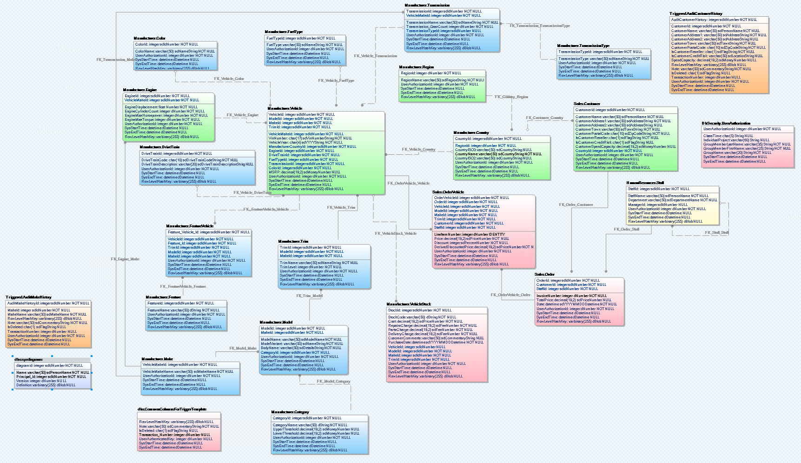
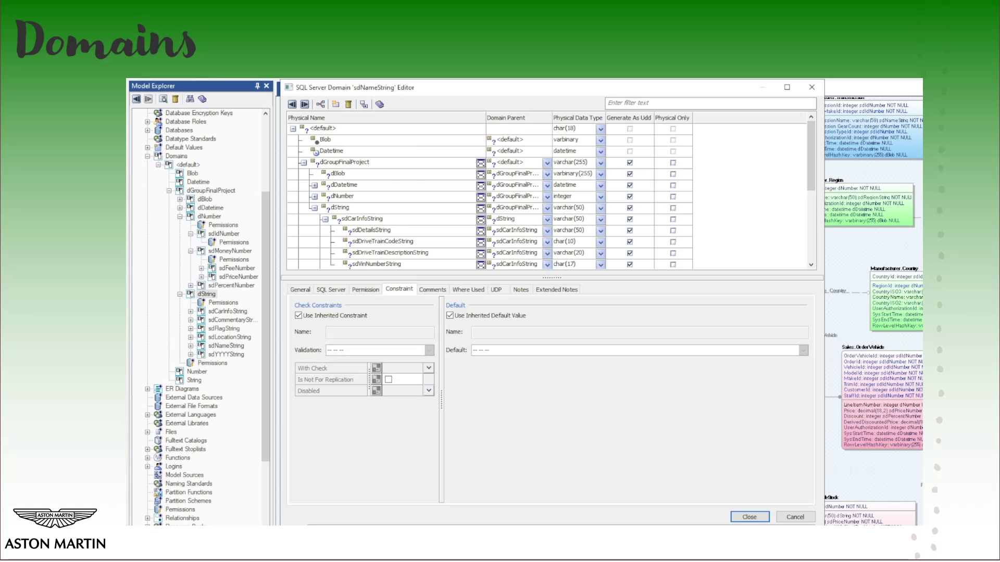
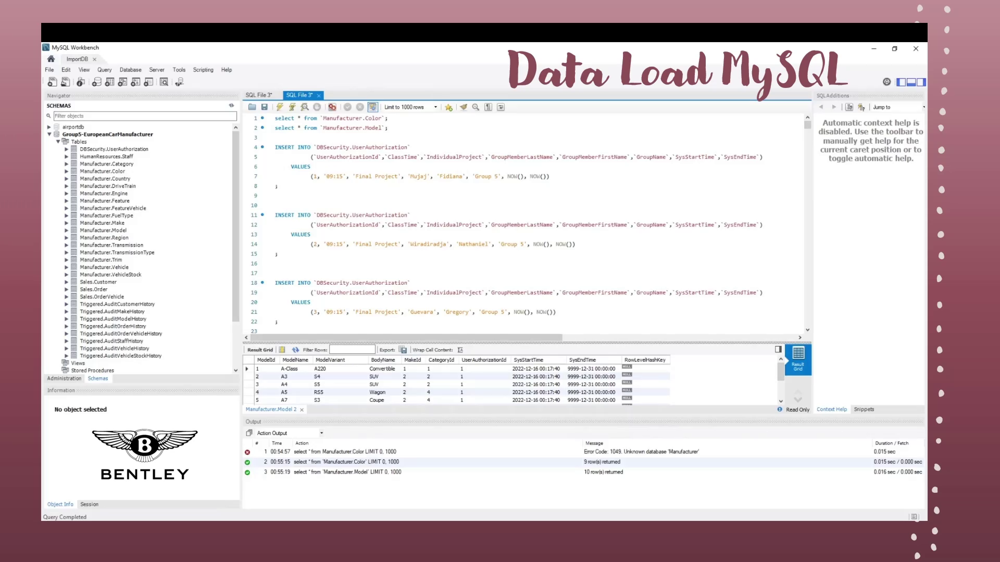

# ErwinDM-Group-Project
This group project aimed to explore Erwin Data Modeler to develop a comprehensive business data model, complete with database implementation, aligning with business objectives and a focus on intuition.

From conceptual design to implementation, we crafted detailed diagrams, including entity attributes and relationships, as well as fully fleshed out tables with constraints and validations. We kept documents and utilized GitHub to organize and track team efforts, prepared an executive overview, and put together an insightful video presentation to go over the model's impact and effectiveness.

See the presentation video [on Youtube](https://youtu.be/TkNdENWeHyk).
